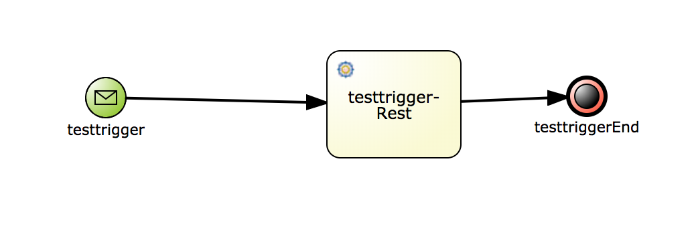
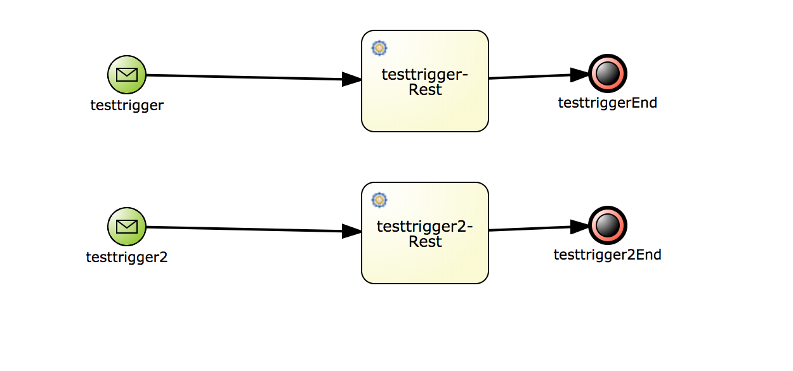

# Serverless Workflow BPMN

Serverless Workflow Specification Version 0.1 - https://github.com/cncf/wg-serverless/blob/master/workflow/spec/spec.md

This project provides:

-   BPMN process generation from JSON conforming to Serverless Workflow Spec
-   Generated BPMN process is targeting executing on Kogito
-   (soon) Multiple generation strategies support to target different execution 
environments and conditions

For more information about the serverless workflow api (heavily used by this project) see:
https://github.com/serverless-workflow/workflow-api

### Getting Started

To build project and run tets:

```
mvn clean install
```

To use this project add the following dependency into your project pom.xml:

```xml
<dependency>
    <groupId>org.servlerless</groupId>
    <artifactId>workflow-bpmn</artifactId>
    <version>1.0-SNAPSHOT</version>
</dependency>
```
### Spec Support
Currently this project supports only a subset of the serverless workflow specification.
Supported are:
* Trigger Events
* Event States
* Actions
* Functions

And additional limitation currently is that that there is only a single function per
action permitted (this will be lifted in the next versions).

### Generation Strategy
Currently there is a single generation strategy present. More will be added in the future.
In the current generation strategy:

* Trigger Events are converted into Message Start events. This plays nicely with Kogito
which has support for Apache Kafka via message start events.
* Action functions are converted into Rest Workitems (so you can easily make http request to resources you need)

### Parsing Examples

Let's say we have a serverless workflow with a single event state. This event state 
includes one action which then has one function defined. 

The json could look like:

```json
{
  "id": "1",
  "metadata" : {
    "id": "testprocess",
    "processn": "testprocessname",
    "package": "com.test.process",
    "version": "1.0"
  },
  "trigger-defs" : [ {
    "id": "2",
    "name" : "testtrigger",
    "source" : "testsource",
    "eventID" : "testeventid",
    "correlation-token" : "testcorrelationtoken"
  } ],
  "states" : [ {
    "id": "3",
    "events" : [ {
      "event-expression" : "trigger.equals(\"testtrigger\")",
      "timeout" : "testTimeout",
      "action-mode" : "SEQUENTIAL",
      "actions" : [ {
        "function" : {
          "name": "Rest",
          "metadata" : {
            "Url": "http://testurl.com/test",
            "Method": "POST"
          }
        },
        "timeout" : 5,
        "retry" : {
          "match" : "testMatch",
          "retry-interval" : 2,
          "max-retry" : 10,
          "next-state" : "testNextRetryState"
        }
      } ],
      "next-state" : "testNextState"
    } ],
    "name" : "eventstate",
    "type" : "EVENT",
    "start" : true
  } ]
}
```

The BPMN process generated would look like this:




Note that the data mapping is all included for you - given a start message event, a process variable
is generated which then is mapped to from the message that triggers the start message event.
This message (now in process var) is then passed as input to the generated workitem.
Once the workitem completes it mapps its output back to the process variable used.


In case you have multiple event states (let's say two), the generated process would include a message 
start event for each, for example:



### More to come soon!
